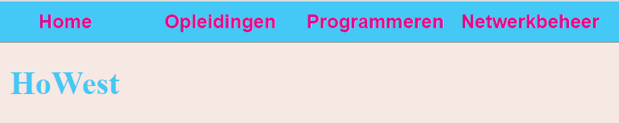
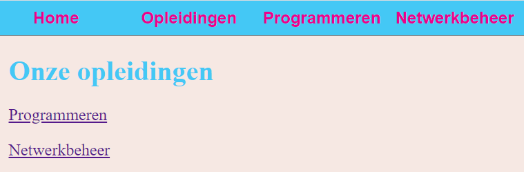
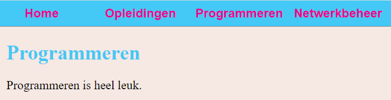
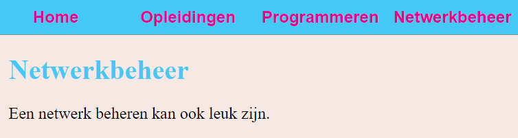

#Navigatie
Een navigatie maken voor een eenvoudige website.
## Screenshots van het resultaat
index.html

opleidingen.html

prog.html

net.html

## HTML
- Breng de nodige wijzigingen aan om het CSS-bestand te gebruiken
- Wijzig de HTML om een menu aan te maken
- Maak hyperlinks naar prog.html en net.html op opleidingen.html

## CSS
Wijzig het css-bestand om het resultaat uit de print screens zo dicht mogelijk te benaderen.
Wanneer de muis over een navigatie-item zweeft, krijgt dit dezelfde achtergrondkleur als de body.
